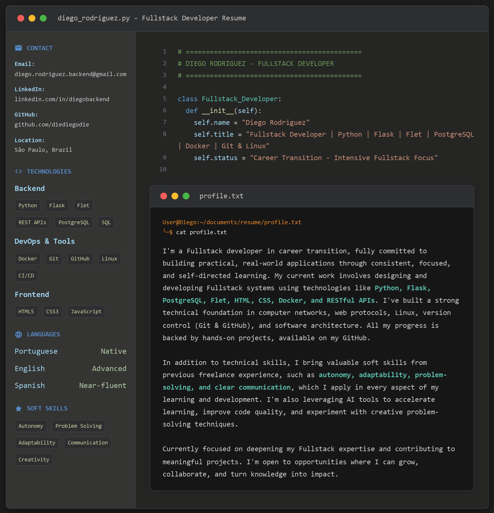

  
Ver versão em texto

# Diego Rodriguez

Fullstack development enthusiast, currently focused on building practical, real-world projects with Python and related technologies.

My stack includes:
- Python
- Flask
- Flet
- SQL & PostgreSQL
- Docker
- REST APIs
- Git & GitHub
- Linux & Shell scripting
- HTML & CSS & JavaScript

Projects on this profile reflect my dedication to learning through hands-on experience.

📫 [LinkedIn](https://www.linkedin.com/in/diegobackend)

